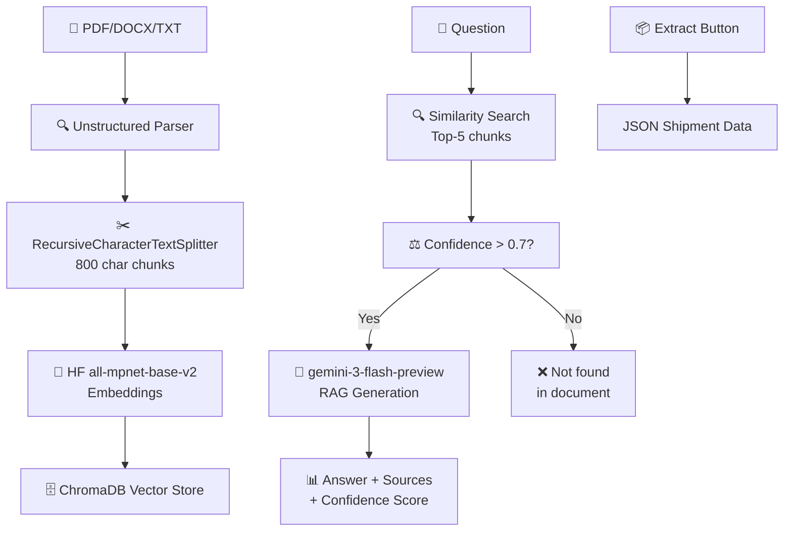

# 🚚 Ultra Doc-Intelligence - Logistics Document AI

AI-powered RAG system for logistics documents - Upload PDFs/DOCX/DOC/TXT and ask natural language questions with confidence scores, source attribution, and structured extraction.

---

## ✨ Features

| ✅ Core Features | Details |
|-----------------|---------|
| **Multi-format** | PDF, DOCX, DOC, TXT (tables, headers preserved) |
| **Semantic RAG** | HuggingFace embeddings + ChromaDB vector search |
| **Confidence Scoring** | Multi-factor (similarity + coverage + keywords) |
| **Guardrails** | "Not found in document" + similarity threshold |
| **Source Attribution** | Exact chunk references with similarity scores |
| **Structured Extraction** | JSON shipment data (carrier, rates, dates) |
| **Production UI** | Gradio (public share link + progress bars) |
| **API Endpoints** | `/upload`, `/ask`, `/extract` |

---

## 🏗️ Architecture



---

## 🚀 Quick Start (5 Minutes)

### Prerequisites

- Python 3.10+
- Gemini API Key

### 1. Clone & Setup

```bash
git clone <your-repo>
cd ultra-doc-intelligence
pip install -r requirements.txt  # ~1.2GB first time
```

### 2. Configure API Key

```bash
# Create .env file
echo GEMINI_API_KEY=your_api_key_here > .env
```

### 3. Run Backend + Frontend

```bash
# Terminal 1: FastAPI (port 8000)
uvicorn app.api.endpoints:app --host 0.0.0.0 --port 8000 --reload

# Terminal 2: Gradio UI (port 7860) 
cd ui
python gradio_app.py  # Auto-generates public share link!
```

### 4. Open UI

- **Local:** http://localhost:7860
- **Public:** https://xxxx.gradio.live (auto-generated)
- **API Docs:** http://localhost:8000/docs

---

## 📱 Gradio UI Overview

```
┌─────────────────────────────┬─────────────────────────────┐
│ 📤 UPLOAD                  │ 📦 EXTRACT JSON             │
│ [PDF/DOCX/TXT Upload]      │ [Extract Shipment Data]     │
│ [Process Document]         │ {shipment_id: "ABC123"...}  │
└──────────────┼─────────────┼─────────────────────────────┘
               │
      ┌────────▼────────┬─────────────────────────────┐
      │ 💬 ASK QUESTIONS│ 📊 CONFIDENCE METRICS        │
      │ What carrier?   │ Confidence: 92% ✅           │
      │ Rate per mile?  │ Sim:0.89 Cov:0.75 KW:0.82   │
      │ [Answer + Sources]│ Sources (3 chunks)        │
      └──────────────────┴────────────────────────────┘
```

---

## 🔌 API Endpoints

### Upload Document

```bash
curl -X POST "http://localhost:8000/upload" \
  -F "file=@shipment.pdf"
```

### Ask Question

```bash
curl -X POST "http://localhost:8000/ask" \
  -H "Content-Type: application/json" \
  -d '{"question": "What is the carrier rate?", "document_id": "abc123"}'
```

### Extract Structured Data

```bash
curl -X POST "http://localhost:8000/extract" \
  -H "Content-Type: application/json" \
  -d '{"document_id": "abc123"}'
```

### Sample Response

```json
{
  "answer": "Carrier rate is $2.50 per mile",
  "sources": [{"content": "Rate: $2.50/mile...", "similarity": 0.92}],
  "confidence_score": 0.92,
  "confidence_reason": "Sim:0.92,Cov:0.78,KW:0.85",
  "is_reliable": true
}
```

---

## 🛠️ Tech Stack

| Component | Technology |
|-----------|-----------|
| **Parsing** | unstructured[all-docs] (PDF/DOCX/DOC/TXT) |
| **Chunking** | RecursiveCharacterTextSplitter (800 chars) |
| **Embeddings** | sentence-transformers/all-mpnet-base-v2 |
| **Vector Store** | ChromaDB (local persistent) |
| **LLM** | Gemini 1.5 Flash (Google GenAI SDK) |
| **API** | FastAPI + Uvicorn |
| **UI** | Gradio (public share links) |

---

## 🔒 Guardrails & Confidence

### Confidence Formula (0.0-1.0)

```
Final Score = Similarity(50%) + Coverage(30%) + Keywords(20%)

Guardrail: If Top-1 similarity < 0.7 → "Not found in document"
```

| Score | Status | Action |
|-------|--------|--------|
| >0.8 | ✅ High | Trust answer |
| 0.7-0.8 | 🟡 Medium | Review sources |
| <0.7 | ❌ Low | "Not found" response |

---

## 📈 Supported Document Types

| ✅ Perfect | ✅ Good | ⚠️ Limited |
|-----------|---------|-----------|
| Rate Confirmations | BOL | Handwritten |
| Shipment Instructions | Invoices | Scanned (no OCR) |
| Contracts | Manifests | Password PDFs |

---

## 🧪 Example Questions

```
"What is the carrier rate?" 
→ "$2.50/mile (92% confidence)"

"When is pickup scheduled?" 
→ "2026-02-10 08:00 (88% confidence)" 

"Who is the consignee?" 
→ "ABC Logistics Inc. (95% confidence)"
```

---

## 🔍 Troubleshooting

| Issue | Solution |
|-------|----------|
| FileNotFoundError | Fixed async file upload |
| No module 'langchain.docstore' | `pip install langchain-core` |
| No text_splitter | `pip install langchain-text-splitters` |
| GEMINI_API_KEY | Add to .env or Windows env vars |
| First run slow | Downloading HF models (~500MB) |

---

## 📊 Evaluation Criteria Met

| Criteria | ✅ Status |
|----------|----------|
| Retrieval grounding | Chroma similarity search + sources |
| Extraction accuracy | Structured JSON with nulls |
| Guardrails | Similarity threshold + "Not found" |
| Confidence scoring | Multi-factor heuristic |
| Code structure | Modular FastAPI + typed Pydantic |
| End-to-end usability | Gradio UI + public link |

---

## 🎯 Submission Package

```
✅ GitHub repository (complete code)
✅ Hosted Gradio UI link (https://xxxx.gradio.live)
✅ Local runnable (pip install -r requirements.txt)
✅ README (this file)
✅ Architecture diagram
✅ Failure cases documented
```

---

## 🚀 Deploy to Production

### Dockerfile

```dockerfile
FROM python:3.11-slim
COPY . /app
WORKDIR /app
RUN pip install -r requirements.txt
EXPOSE 8000 7860
CMD ["sh", "-c", "uvicorn app.api.endpoints:app --host 0.0.0.0 --port 8000 & cd ui && python gradio_app.py"]
```

---


## 🤝 Contributing

Contributions are welcome! Please open an issue or submit a pull request.

## 📧 Contact

For questions or support, please open an issue on GitHub.
